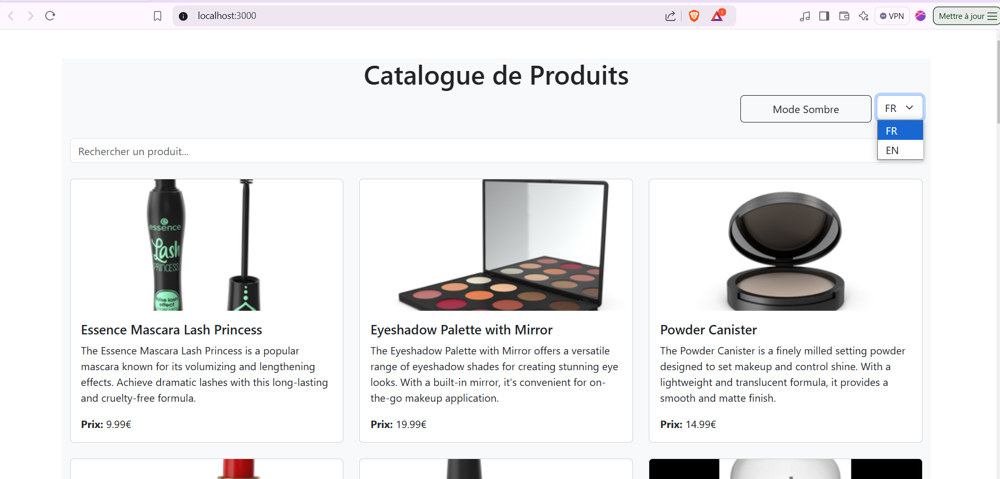

# TP React Hooks - Application de Gestion de Produits

Ce TP a pour objectif de mettre en pratique l'utilisation des Hooks React (useState, useEffect, useContext) ainsi que la création de Hooks personnalisés.

## Installation et configuration initiale

1. Cloner le dépôt :
```bash
git clone https://github.com/pr-daaif/tp-react-hooks.git
cd tp-react-hooks
```

2. Créer votre propre dépôt sur Github et changer le remote :
```bash
# Supprimer le remote origine
git remote remove origin

# Ajouter votre nouveau remote
git remote add origin https://github.com/[votre-username]/tp-react-hooks.git

# Premier push
git push -u origin main
```

3. Installer les dépendances :
```bash
npm install
```

4. Lancer l'application :
```bash
npm start
```

## Instructions pour le TP

Pour chaque exercice :
1. Lisez attentivement l'énoncé
2. Implémentez la solution
3. Testez votre implémentation (pensez à faire des copies d'écran)
4. Mettez à jour la section correspondante dans ce README avec :
   - Une brève explication de votre solution
   - Des captures d'écran montrant le fonctionnement
   - Les difficultés rencontrées et comment vous les avez résolues
5. Commitez vos changements avec un message descriptif

### Exercice 1 : État et Effets 
#### Objectif : Implémenter une recherche en temps réel

- [ ] 1.1 Modifier le composant ProductSearch pour utiliser la recherche
- [ ] 1.2 Implémenter le debounce sur la recherche
- [ ] 1.3 Documenter votre solution ici

_Votre réponse pour l'exercice 1 :_
```
1.3 Documentation
j’ai géré l’état de la recherche dans le composant parent. J’ai d’abord utilisé useState dans le composant parent pour stocker la valeur de l’input de recherche. Cette valeur est ensuite transmise au composant ProductSearch via une prop. Là, je capture la saisie de l’utilisateur et je mets à jour l’état de la recherche dans le parent à l’aide de setProductsearchValue que je transmets également en prop. Ensuite, cette valeur de recherche est envoyée à ProductList ou je filtrais les produits basés sur la recherche, pour s’assurer qu’il n’y est que les produits correspondants, je modifie l’affichage .
j’ai utilisé useEffect pour gérer le délai avant d’effectuer la recherche. En combinant useEffect et le debounce, je peux m’assurer que la recherche est effectuée uniquement après que l'utilisateur a cessé de taper pendant un court moment, améliorant ainsi les performances et l’expérience utilisateur.

Expliquez votre solution ici
[Ajoutez vos captures d'écran]
```


### Exercice 2 : Context et Internationalisation
#### Objectif : Gérer les préférences de langue

- [ ] 2.1 Créer le LanguageContext
- [ ] 2.2 Ajouter le sélecteur de langue
- [ ] 2.3 Documenter votre solution ici

_Votre réponse pour l'exercice 2 :_
```
Création du LanguageContext :
J'ai créé un contexte (LanguageContext) dans App.js pour gérer et partager la langue choisie dans l'application. Ce contexte utilise useState pour stocker la langue actuelle et une fonction setLanguage pour la mettre à jour.

Création du LanguageSelector :
J'ai développé un composant LanguageSelector qui permet à l'utilisateur de choisir la langue. Ce composant met à jour la langue dans le contexte lors d'un changement de sélection.

Mise à jour des composants enfants :
Les composants enfants utilisent LanguageContext pour accéder à la langue sélectionnée et afficher les informations dans la langue choisie.

Expliquez votre solution ici
[Ajoutez vos captures d'écran]
```


### Exercice 3 : Hooks Personnalisés
#### Objectif : Créer des hooks réutilisables

- [ ] 3.1 Créer le hook useDebounce
- [ ] 3.2 Créer le hook useLocalStorage
- [ ] 3.3 Documenter votre solution ici

_Votre réponse pour l'exercice 3 :_
```
3.1
J'ai créé un hook personnalisé useDebounce pour retarder la mise à jour d'une valeur, comme un terme de recherche. Ce hook prend une valeur et un délai en millisecondes, puis utilise setTimeout pour appliquer le délai avant de mettre à jour la valeur. Grâce à useEffect, le timer redémarre chaque fois que la valeur ou le délai change, évitant ainsi des appels trop fréquents à la fonction de recherche. Cela améliore les performances lors de saisies rapides.
3.2
Pour synchroniser un état avec le localStorage, j'ai créé le hook personnalisé useLocalStorage. Ce hook prend une clé et une valeur initiale. Si une valeur est déjà présente dans le localStorage, elle est utilisée comme état initial, sinon la valeur par défaut est appliquée. À chaque mise à jour de l'état, la nouvelle valeur est automatiquement enregistrée dans le localStorage, garantissant la persistance des données même après un rechargement de la page.

Expliquez votre solution ici
[Ajoutez vos captures d'écran]
```


### Exercice 4 : Gestion Asynchrone et Pagination
#### Objectif : Gérer le chargement et la pagination

- [ ] 4.1 Ajouter le bouton de rechargement
- [ ] 4.2 Implémenter la pagination
- [ ] 4.3 Documenter votre solution ici

_Votre réponse pour l'exercice 4 :_
```
Expliquez votre solution ici
[Ajoutez vos captures d'écran]
```

## Rendu

- Ajoutez l'URL de votre dépôt Github dans  **Classroom** et envoyer la réponse dès le démarage de votre projet.
- Les push doivent se faire au fûr et à mesure que vous avancez dans votre projet.
- Le README.md doit être à jour avec vos réponses et captures d'écran. 
- Chaques exercice doit faire l'objet d'au moins un commit avec un message mentionnant le numéro de l'exercice.